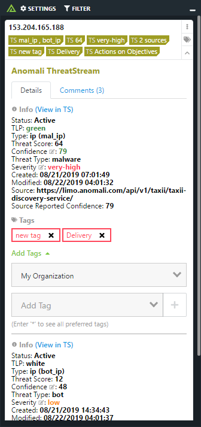

# Polarity Anomali ThreatStream Integration

Polarity's ThreatStream integration gives users access to automated IPv4 lookups within Anomali's ThreatStream platform..

To learn more about Anomali ThreatStream please see their official website at [https://www.anomali.com/platform/threatstream](https://www.anomali.com/platform/threatstream)

|   |
|---|
|*Anomali ThreatStream Example* |

## ThreatStream Integration Options

### Anomali ThreatStream API Server URL

The URL for your ThreatStream API server which should include the schema (i.e., http, https) and port if required.  For example `https://api.threatstream.com`

> Note that the API server value cannot end with a trailing `/`.

### Anomali ThreatStream UI Server URL

The URL for your ThreatStream UI server which should include the schema (i.e., http, https) and port if required.  For example `https://ui.threatstream.com`

### Username

Your Anomali ThreatStream username

### API Key

The API Key for the provided ThreatStream user

### Minimum Severity Level

A string value which specifies the minimum severity level required for an indicator to be displayed.   For example, if you set the value to high then only indicators with a severity level of "high" or "very-high" will be displayed in the notification overlay.

Allowed values are "low", "medium", "high", "very-high"

### Minimum Confidence Level

An integer value between 0 and 100 which specifies the minimum confidence level required for an indicator to be displayed.   For example, if you set the value to 55 then only indicators with a confidence of 55 or above will be displayed in the notification overlay.

### Active Threats Only

If set to true, only threats which have a status of `Active` will be displayed.

### Ignore Private IPs

If set to true, private IPs (RFC 1918 addresses) will not be looked up (includes 127.0.0.1, 0.0.0.0, and 255.255.255.255)

## Polarity

Polarity is a memory-augmentation platform that improves and accelerates analyst decision making.  For more information about the Polarity platform please see:

https://polarity.io/
